# Data Lovers

## Índice

* [1. Definición](#1-definición)
* [2. Definición del producto](#2-definición-del-producto)
* [3. Historias de usuario](#3-historias-de-usuario)
* [4. Prototipos](#4-prototipos)
* [5. Test de Usabilidad](#5-test-de-usabilidad)
* [6. Página Finalizada](#6-página-finalizada)
* [7. Link al sitio](#7-link-al-sitio)

***
## 1. Definición  
# Studio Ghibli

Studio Ghibli es un estudio de animación japonés, conocido por sus largometrajes
animados como **Mi vecino Totoro**, **El viaje de Chihiro** o
**El castillo ambulante**, entre otros grandes éxitos.

Las animaciones tienen gran acogida a nivel mundial y algunas han recibido
varias nominaciones y premios. De todo este fandom hay un grupo que desea poder
interactuar y ver la información de las animaciones y sus personajes.
## Hallazgos

Para entender mejor qué información podrían necesitar nuestras usuarias,
hicimos una rápida investigación (research) y estos son algunos de los
hallazgos.

- Studio Ghibli tiene varias animaciones, para nuestras usuarias es importante
  saber cuántas y cuáles son.
- Las animaciones tienen directorxs y productorxs. Estxs son las mentes detrás
  de una gran animación. En Studio Ghibli hay directorxs y productorxs que han
  colaborado en la creación de más de una animación. Por ello, es importante
  para nuestra usuaria poder conocerlos y saber cuántas y cuáles son las
  animaciones a las que dieron "vida".
- Las animaciones tienen información relevante para nuestras usuarias, como
  descripción, fecha de lanzamiento, peso, director, productor y personajes.
- Cada animación tiene sus personajes, para nuestras usuarias es importante
  saber cuántos y cuáles son
- Los personajes tienen características únicas que la usuaria quiere saber, como
  nombre, edad, género, especie, etc.
- Las animaciones tienen locaciones y vehículos únicos en cada una. Para
  nuestras usuarias es importante saber cuáles son.
- Adicionalmente a esta información, para nuestras usuarias es importante poder
  ver los tipos de especies que hay en cada animación.
## 2. Definición del producto

La página Ghibli's Collection nace ante la necesidad de nuestros usuarios (fans de Ghibli y aficionados a las películas animadas) de obtener información de las películas creadas a la fecha por el estudio.

La página tiene 5 funciones clave para lograr satisfacer dichas necesidades:

1.- Barra de búsqueda:

En ella se podrá buscar el nombre de las películas, si estas coinciden con los registros serán mostradas en la página principal.

2.- Despliegue de modal:

Al hacer clic por sobre la imagen de la películas, se desplegará en pantalla más información sobre ellas, tales como: reseña de la película, valoración de la crítica, título, año de estreno y director.

3.- Filtrar por director:

Al seleccionar un director en el combobox del landing, se desplegarán todas las películas que coincidan con ese director.

4.- Ordenar las películas en orden ascendente o descendente: 

Si el usuario desea visualizar las cartas de las películas en orden de la A a la Z o de la Z a la A, podrá hacerlo seleccionando la opción correspondiente en el combobox asignado para ello en el menú principal.

5.- Ordenar las películas de acuerdo a la fecha de estreno:

Si el usuario desea visualizar las cartas de las películas en orden de acuerdo a la fecha de estreno, podrá hacerlo seleccionando la opción correspondiente en el combobox asignado para ello en el menú principal.
## 3. Historias de usuario 
   
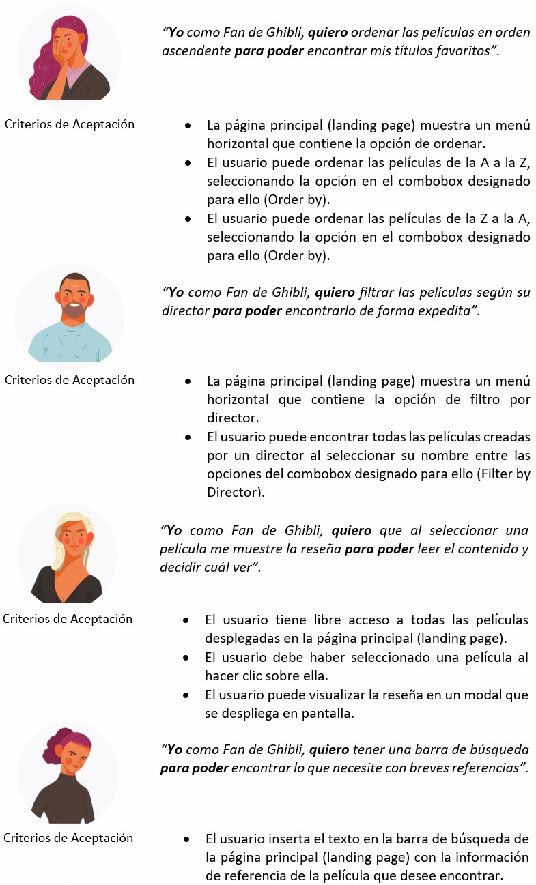

Definición de terminado  

- El código cumple con el diseño propuesto en el prototipo.
- El código está en la rama Main en el repositorio de GitHub.
- El código pasa las pruebas unitarias correspondientes.
- El código ha sido construido en modo pair-programming.
- El código ha sido revisado por integrantes del bootcamp (Code-Review).
- Las historias han sido testeada por usuarios que conocen la temática y se han incorporado mejoras de acuerdo a los feedback recibidos.
- La funcionalidad de la página está acorde a las necesidades de los usuarios.
- El código ha sido ejecutado siguiendo buenas prácticas de programación. 

## 4. Prototipos

## Prototipos de baja fidelidad
*Landing*

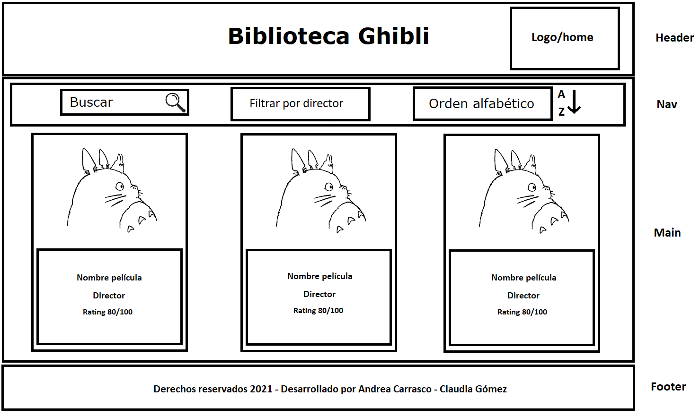

*Vista desplegando información*

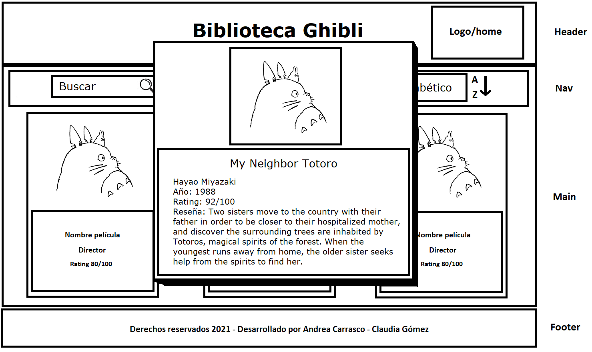

## Prototipos de alta fidelidad
*Tamaño Desktop, Landing*

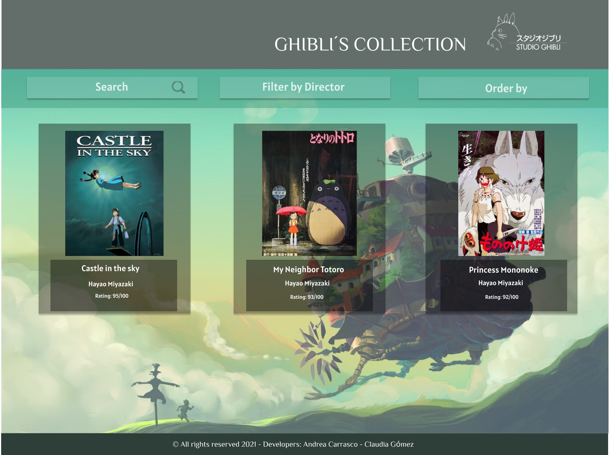

*Tamaño Desktop, Modal desplegado*

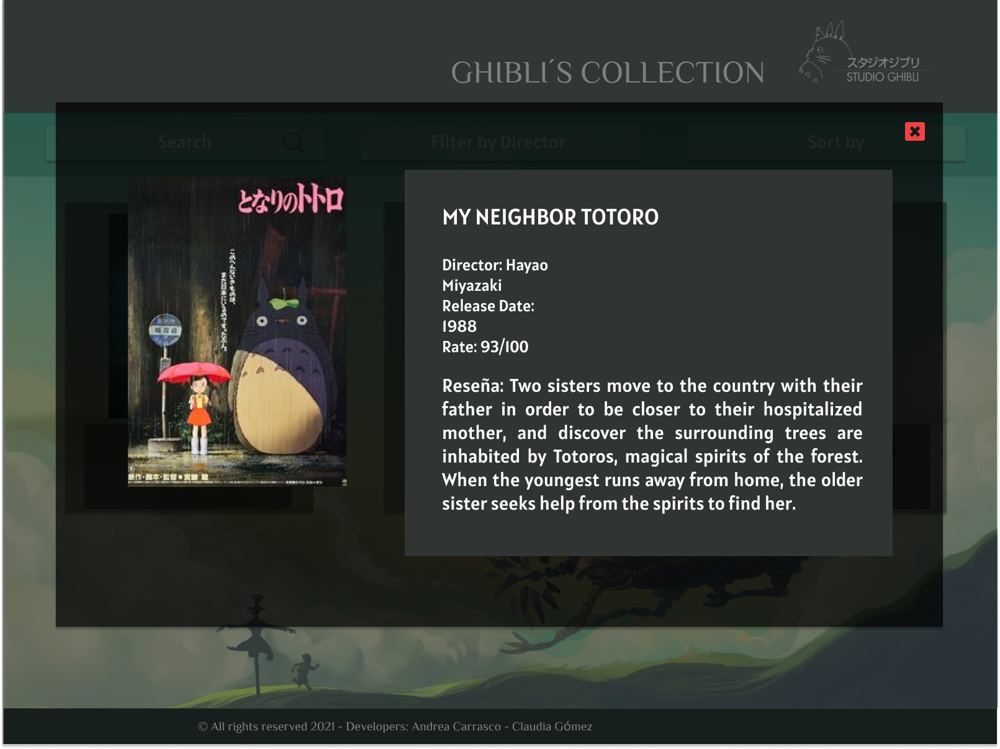

*Tamaño Tablet, Landing*

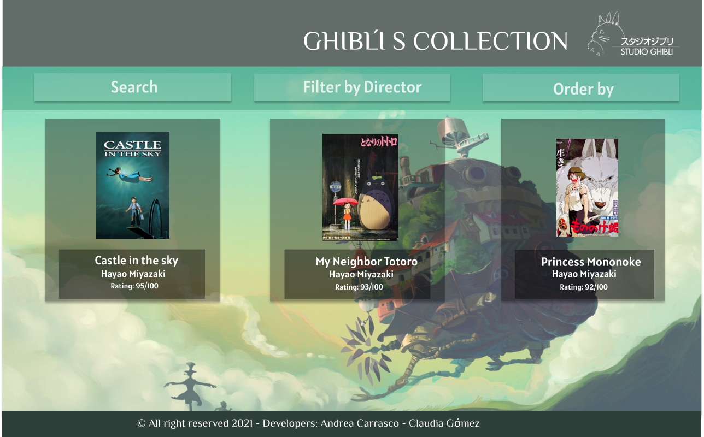

*Tamaño Tablet, Modal desplegado*

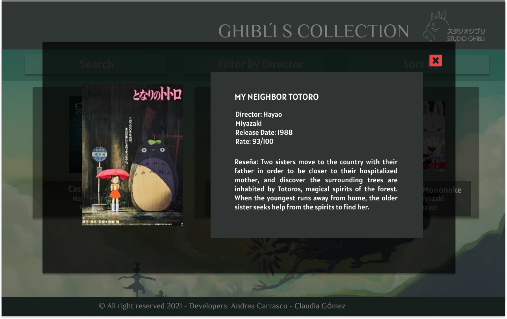

*Tamaño Mobile, Landing*

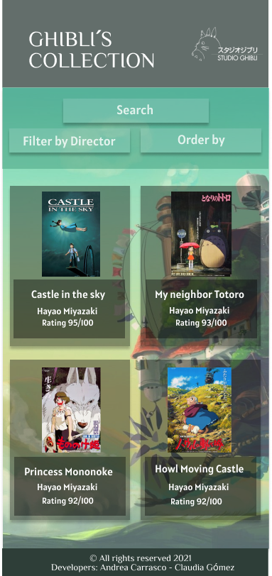

*Tamaño Mobile, Modal desplegado*

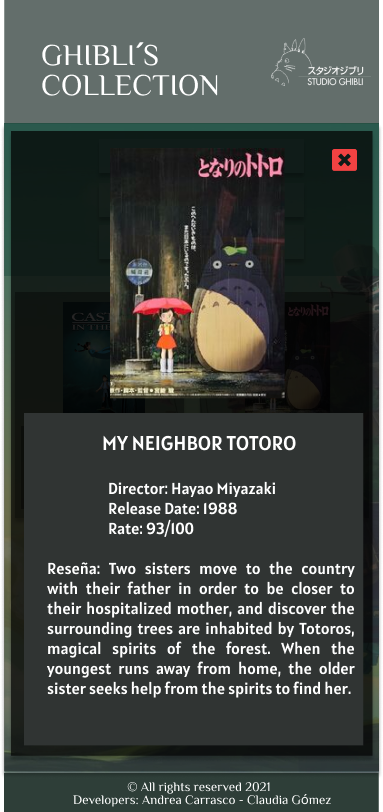
## 5. Test de Usabilidad  

Durante el desarrollo del proyecto se realizaron entrevistas personales y en grupo a distintos usuarios para probar la usabilidad del prototipo
y se llegó a la conclusión de que era necesario modificar algunos elementos para mejorar su comportamiento. A raíz de ello, se agregó lo siguiente:

- Se agregó un ícono de salir para cerrar los modales y volver a la página del landing.
- Se modifica el texto del combobox Sort by por Order by para mejorar la comprensibilidad de la acción a realizar.
- Se agregó más información al modal (rate score, release date) referente a los intereses de los usuarios.
- Se agregó una opción que ordene las películas de acuerdo a la fecha de estreno.
- Se agregó un botón home para volver a la página de inicio facilmente.
- Se modifican los elementos de la barra de navegación en la versión mobile para que estos colapsen en columna y que se desplieguen las opciones del combobox sin interferir en la correcta lectura de los otros filtros.

## 6. Página Finalizada

*Landing Page*

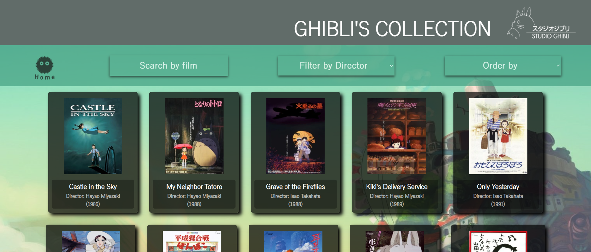

*Modal desplegado*

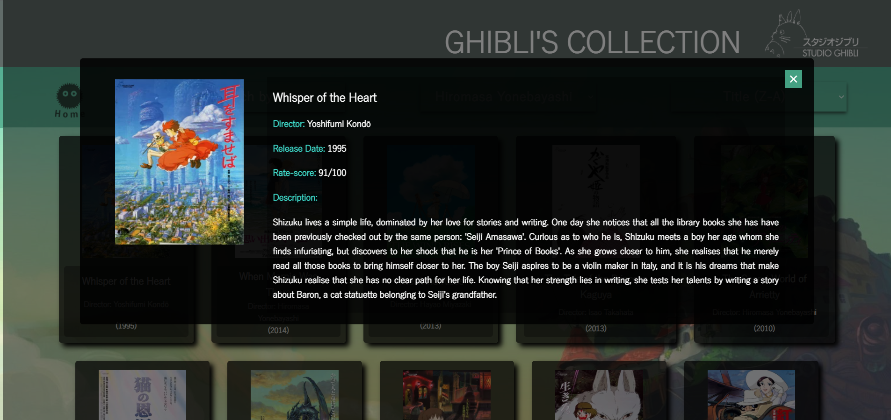

*Filtro por director aplicado*

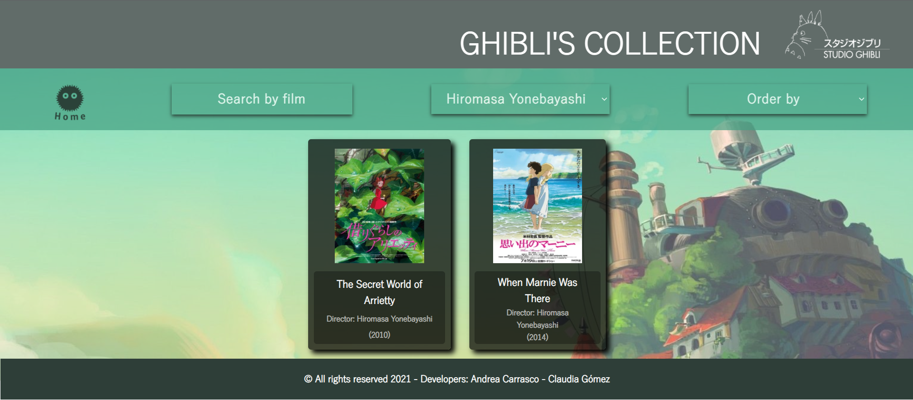

*Ordenando información de la Z a la A*

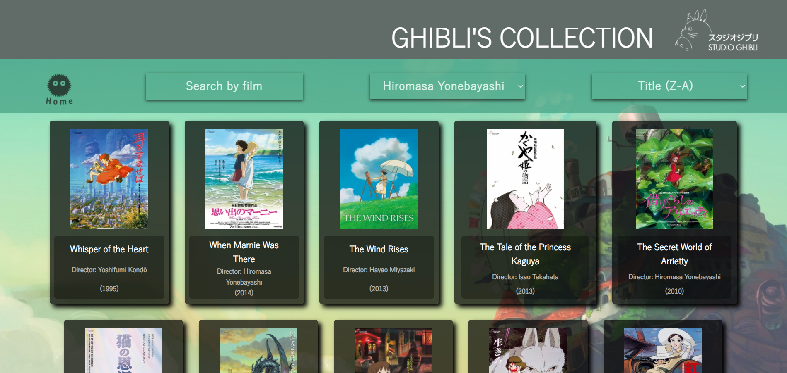

## 7. Link al sitio

https://andreacarrascor.github.io/SCL018-data-lovers/src/

